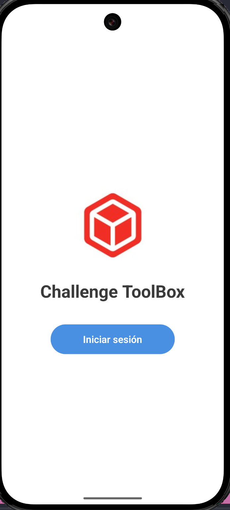
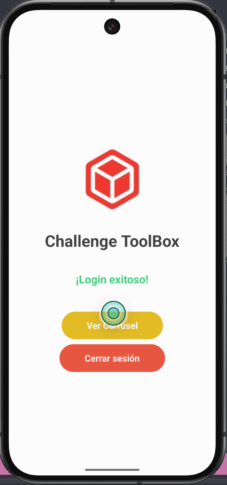
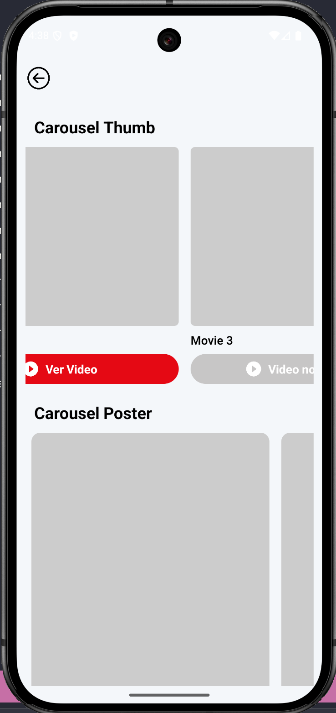
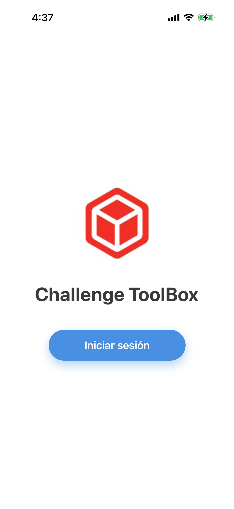
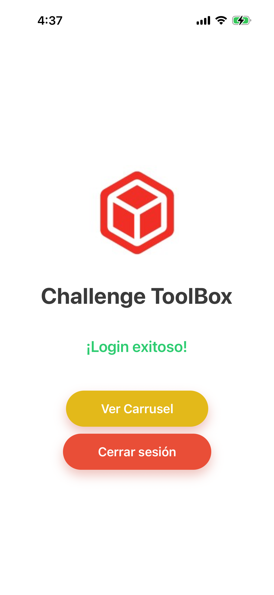
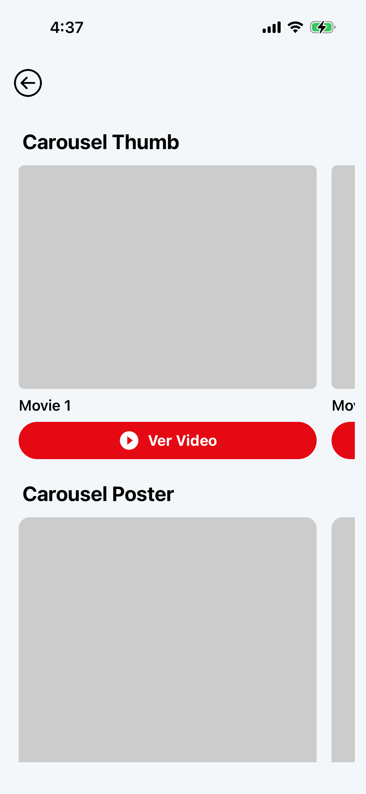

This is a Challenge for Toolboxtve.

The project was build with React Native V0.81.0.


# Getting Started

> **Note**: Make sure you have completed the [Set Up Your Environment](https://reactnative.dev/docs/set-up-your-environment) guide before proceeding.

## Install dependencies.

You need install project dependencies. In the root of project exec.

```sh
# Using npm
npm install

# OR using Yarn
yarn install
```

## Start Metro.

After setup your environment, you can start Metro.
First, you will need to run **Metro**, the JavaScript build tool for React Native.

To start the Metro dev server, run the following command from the root of your React Native project:


```sh
# Using npm
npm start

# OR using Yarn
yarn start
```

## Init Android

With Metro running, open a new terminal window/pane from the root of your React Native project, and use one of the following commands to build and run your Android or iOS app:

### Android

```sh
# Using npm
npm run android

# OR using Yarn
yarn android
```

### Init iOS

For iOS, remember to install CocoaPods dependencies (this only needs to be run on first clone or after updating native deps).

```sh
cd ios && pod install
```

In the root of project, exec iOS.

```sh
# Using npm
npm run ios

# OR using Yarn
yarn ios
```

## Screenshots

### Android





### iOS



